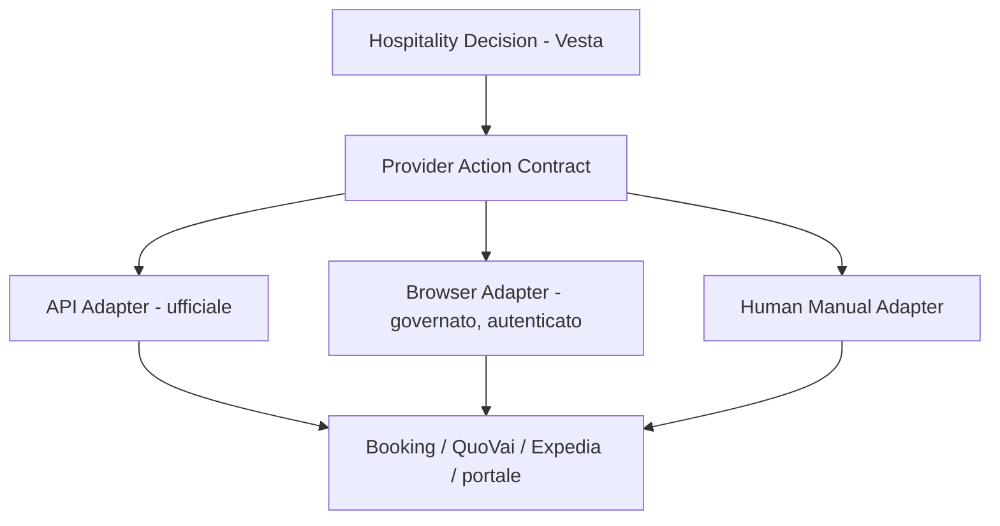

# SYSTEM MAP — Vesta Hospitality Operating System (current → target)

> **Che cos'è questo documento.** La **mappa canonica del sistema operativo target**: che cosa deve
> diventare Vesta, dominio per dominio, con lo stato corrente onesto accanto a ogni target. È il
> documento che permette a un agente (o a una persona nuova) di sviluppare Vesta senza dipendere
> dalle vecchie chat o dalla testa del founder.
> **Confine SSOT (ADR-0006):** i **principi** vivono in [PRODUCT](foundations/PRODUCT.md) (Costituzione);
> il **comportamento operativo corrente vincolante** vive in [WORKFLOW](foundations/WORKFLOW.md);
> l'**ordine di implementazione** vive in [ROADMAP](ROADMAP.md); il **come tecnico** vive in
> [ARCHITECTURE](ARCHITECTURE.md); le **scelte vincolanti** in [DECISIONS](DECISIONS.md). Questa mappa
> non li duplica: li collega e aggiunge il livello che mancava — il **target operativo per dominio**.
> **Istituita da:** [ADR-0022](DECISIONS.md) (28/09/2026, input founder approvati). Modificarla per i
> target = decisione di prodotto (ADR); aggiornarne gli status correnti = manutenzione del Context Layer.

**Legenda status (tracciabilità §8 del mandato):**
✅ LIVE/VERIFIED · ◐ BUILT/PARTIAL · ◇ APPROVED TARGET · ○ FUTURE DIRECTION · ? OPEN DECISION · ✕ SUPERSEDED
**Provenienza:** `[PRODUCT §n]` `[ADR-nnnn]` `[code: path]` `[archive: file]` `[founder 28/09/2026]` (input di
prodotto approvati per documentazione in questo milestone) — mai falsa precisione: se una cosa è idea
storica resta idea storica; se è aperta resta aperta.

---

## 0. Principio base

Vesta deve diventare un **HOSPITALITY OPERATING SYSTEM / AI OPERATIONS LAYER** per B&B,
affittacamere, boutique hospitality, piccoli hotel e strutture indipendenti con molto lavoro operativo
e poco staff `[PRODUCT §3, §7]` `[founder 28/09/2026]`.

**NON è**: un chatbot · una FAQ · un wrapper AI · un semplice concierge · un PMS sostitutivo · un
channel manager · un software contabile · un insieme scollegato di automazioni `[PRODUCT §5, §6, §20]`.

Il suo valore è sapere: **cosa sta succedendo · cosa va fatto · quando · da chi · con quale fonte
attendibile · con quale rischio · quale policy si applica · quando serve approvazione umana · cosa
succede dopo · se l'azione è stata davvero completata · cosa va ricordato**. L'AI è il motore
nascosto; **il prodotto è il workflow operativo hospitality** `[PRODUCT §13, §18]` `[founder 28/09/2026]`.

**Loop canonico di ogni dominio:**

```
INTAKE → UNDERSTAND → DECIDE → ACT / PROPOSE → FOLLOW-UP → VERIFY → REMEMBER
```

Ogni scheda di dominio (§4) è la specializzazione di questo loop: problema operativo, attore, fonte
attendibile, intake, logica di decisione, azione, rischio, confine di approvazione umana,
follow-through, verifica, memoria/stato, status corrente, stato target.

---

## 1. Modello di autonomia progressiva (L0 → L4) ◇ `[ADR-0024]` `[founder 28/09/2026]`

| Livello | Nome | Che cosa fa Vesta |
|---|---|---|
| **L0** | OBSERVE | legge, organizza, rileva (nessun effetto esterno) |
| **L1** | RECOMMEND | propone azioni con motivazione, fonte e confidenza |
| **L2** | APPROVE & EXECUTE | lo staff approva la singola azione; Vesta la esegue e la verifica |
| **L3** | POLICY DELEGATION | Jacopo approva un **envelope/policy**; le azioni della classe delegata si eseguono senza stop per-azione |
| **L4** | AUTONOMOUS OPERATIONS | Vesta esegue autonomamente **SOLO** classi di azione già delegate, dentro i bound della policy |

- La delega è **specifica** per: workflow · property · provider · classe di azione · livello di rischio ·
  policy bounded. **Non esiste "autonomia totale" generica** `[ADR-0024]`.
- Ogni azione porta con sé: **source · confidence · actor · policy · risk · approval state ·
  execution evidence · verification · audit · recovery/rollback** quando applicabile.
- **Il confine corrente resta ADR-0011** (nessuna azione autonoma che modifichi lo stato operativo
  senza integrazione PMS affidabile; Tier-2 sempre approvato dallo staff): L3/L4 sono il target, non
  lo stato. Il meccanismo di delega per-milestone già vivo nel processo di sviluppo è [ADR-0021].
- Stato corrente del prodotto sui livelli: L0 ✅ (router, code, documenti, iCal) · L1 ◐ (bozze
  `autosend_off`, proposte Tier-2) · L2 ✅ per il flusso commerciale (click staff → invio) · L3/L4 ◇.

---

## 2. Modello di esecuzione provider ◇ `[ADR-0023]` `[founder 28/09/2026]`

### 2.1 Provider Action Contract

Il workflow hospitality **non deve dipendere dal mezzo di esecuzione**:



Ordine canonico di scelta dell'adapter:
1. **API/connector ufficiale** — quando disponibile, affidabile ed **economicamente giustificato**;
2. **browser/UI automation governata e autenticata** — con account Vesta **dedicato e
   minimum-privilege** (già creati/previsti per Booking e QuoVai `[founder 28/09/2026]`);
3. **human manual adapter** — finché API/browser non sono sicuri o disponibili (è lo stato corrente:
   lo staff opera in QuoVai a mano, `[code: lib/tasks/catalog.ts:49]`).

La browser automation è un **execution adapter di prima classe, NON un hack temporaneo**: le API
possono non esistere, essere riservate a partner, costose o incomplete — Vesta non è progettata
sull'assunzione "provider operation = API integration required" `[ADR-0023]`. Oggi → browser; domani
→ API ufficiale; **il workflow Vesta non si ridisegna**.

> Nota storica: [archive/pricing-availability-architecture.md] §3.1 preferiva l'osservazione OTA
> "manuale (no scraping automatico)". Quella preoccupazione (fragilità/ToS) resta valida per lo
> scraping non sanzionato; è **superata (✕, ADR-0023)** per il caso diverso del **browser governato
> con account propri dedicati**, evidence e approval gate.

### 2.2 Confine di riuso WorkspaceOS (browser) ◇

**Vesta NON costruisce un browser generico.** WorkspaceOS ha sviluppato/studiato capability
generiche di Browser Operations (due filoni storici distinti: `public-web-read` per navigazione
pubblica governata SEARCH→OPEN→READ→FOLLOW→EXTRACT→EVIDENCE, e Browser Operations con
browser/profile persistenti e sessioni autenticate). **Lo stato vivo di quelle capability non è
asserito qui: la loro source of truth è il repo WorkspaceOS** — questo è un seam dichiarato, non una
dipendenza. Boundary target:

```
VESTA (owner):   intent hospitality · workflow · decisione · policy · risk class ·
                 approval policy · expected result · verifica post-azione · follow-up ·
                 semantica di audit hospitality · perché entrare nel portale · quale dato
                 cercare · come interpretarlo
        ↓  Provider Action Contract
GENERIC BROWSER CAPABILITY (WorkspaceOS / infrastruttura riusabile, owner):
                 runtime browser · sessioni · credential isolation · navigazione · form ·
                 upload/download · evidence · governance · retry/recovery · primitive generiche
        ↓
ADAPTER provider-specific (possono vivere lato Vesta se dominio/provider-specific):
                 selettori/procedure Booking · QuoVai · Expedia · portali
```

**La logica di dominio hospitality non migra mai in WorkspaceOS** `[PROJECT_RULES]` `[ADR-0020]`.

### 2.3 Browser governance target ○ (contract, da NON implementare in questo milestone)

La futura capability autenticata deve supportare: account dedicati minimum-privilege · credential
isolation (mai credenziali in repo/chat) · sessioni/profili separati per identity/provider · login ·
navigazione profonda e pagine dinamiche · tab/finestre · ricerca · form · upload/download ·
estrazione · screenshot/evidence before/after · provenance durevole · **action preview → approval
gate → bounded authorization** · retry controllati · recovery · final-state verification ·
fail-closed. Pagamenti, azioni irreversibili, secrets e modifiche di sicurezza provider **mantengono
sempre il loro Human Authority boundary**, a qualunque livello di autonomia.

---

## 3. Confini di piattaforma

| Piattaforma | Ruolo | Può possedere | NON possiede mai |
|---|---|---|---|
| **WorkspaceOS** | control plane / infrastruttura di esecuzione generica | orchestrazione · authority/approvals · browser runtime generico · credenziali · evidence · recovery · task lifecycle generico | logica di dominio hospitality |
| **Jacopo Office** | back-office operativo generico | Gmail · Drive · browser · documenti · evidence · dossier · ricerca generica · calendar · financial read generico · connector adapters | semantica hospitality |
| **Vesta** | prodotto hospitality | intent · workflow · business policy · stato operativo · guest journey · semantica delle provider action · decisioni revenue · operations di struttura · follow-up | infrastruttura generica duplicata |

Regole: nessuna dipendenza forte prematura; seam/adapter minimi quando il riuso è maturo; **non
fondere i prodotti** `[ADR-0022]` `[ARCHITECTURE: Document Intelligence — confine Jacopo Office]`.

---

## 4. Domini

Formato di ogni scheda: **Problema · Attore · Fonte attendibile · Intake · Decisione · Azione ·
Rischio · Approvazione umana · Follow-through · Verifica · Memoria/stato · CURRENT · TARGET.**

### A. Guest Experience & Concierge

- **Problema:** l'ospite ha bisogno di risposte e indicazioni affidabili prima/durante/dopo il
  soggiorno senza consumare tempo staff; la struttura ha bisogno che nulla venga inventato.
- **Attore:** Vesta (Tier-1 automatico) → staff su escalation `[WORKFLOW]`.
- **Fonte attendibile:** knowledge base curata della property (`knowledge_assets`, mai l'AI da sola)
  `[ADR-0012]` `[KNOWLEDGE]`.
- **Intake:** chat web `/c/[property]` ✅ · email ✅ · WhatsApp ◐ (inerte fino a credenziali Meta).
- **Decisione:** pipeline knowledge-first (regole → KB → AI come componente) `[code: lib/ai/pipeline.ts]`.
- **Azione:** risposta Tier-1; su intent commerciale passa al dominio B; su trigger di escalation →
  umano (pattern reclami/recensioni/rimborsi già attivi `[code: lib/ai/guardrail.ts]`).
- **Rischio:** inventare policy/prezzi; over-promising. Mitigazioni live: prezzi mai dall'AI, KB-only,
  budget cap, guardrail.
- **Approvazione umana:** Tier-2 sempre staff `[ADR-0011]`.
- **Follow-through:** notifica staff quando la KB non copre la domanda ✅ (`answered_from_kb`).
- **Verifica:** log `ai_calls`, provenienza risposta.
- **Memoria:** KB versionata ✅; gap→suggestion loop ◐ (solo schema `kb_suggestions`).
- **CURRENT:** ✅ Tier-1 in produzione (5 lingue, richieste miste); ◐ raccomandazioni locali = solo
  contenuto KB (tag `zona`: ristoranti/consigli); ◐ `StaffReplyBox` è ancora mock `[code:
  components/staff-reply-box.tsx]`.
- **TARGET ◇ `[founder 28/09/2026]`:** knowledge operativa completa (check-in e self check-in,
  check-out, accessi e codici/PIN, reception, deposito bagagli, colazione, parcheggi/garage, ZTL,
  transfer, trasporti, servizi, regole, richieste in soggiorno, problemi, FAQ, servizi specifici) +
  **consigli contestuali**: ristoranti, bar, musei, attrazioni, eventi, shopping, nightlife, guide,
  tour, wine experiences, transfer, esperienze e servizi locali — tenendo conto di profilo/preferenze
  ospite, data, ora, posizione, disponibilità/apertura, meteo, eventi, contesto del soggiorno.
  **Direzione storica "Vesta Experiences" ◇** (in git era solo un token nella linea di crescita
  [BUSINESS]/[ROADMAP]; contenuto formalizzato ora dal founder): partner locali, convenzioni,
  referral, prenotazioni, codici/offerte, tracking, eventuali commissioni. **Vincolo:** il consiglio è
  parte del **guest journey**, mai una guida turistica generica (fallirebbe il gate §18).

### B. Booking / Direct Sales / Guest Journey

- **Problema:** lead persi, conversione diretta bassa, follow-up dimenticati, arrivi non preparati.
- **Attore:** Vesta propone; **lo staff decide** ogni atto vincolante `[WORKFLOW]` `[ADR-0011]`.
- **Fonte attendibile:** `rate_calendar` (mai l'AI) + disponibilità iCal verificata `[code:
  lib/quote/priceEngine.ts, lib/ical/availability.ts]`.
- **Intake:** richiesta da chat/email/WhatsApp → intent → slot (date/ospiti).
- **Decisione:** quote engine deterministico (sconto diretto, last-minute, floor euro, tassa di
  soggiorno esclusa, reliability dal freshness), combinazioni per gruppi.
- **Azione:** preventivo (PDF brandizzato) → scelta camera → `interested` → verifica staff in PMS →
  IBAN + blocco 24h → pagamento → conferma (PDF).
- **Rischio:** overbooking (hold interno non propagato al PMS — KI-5), pagamento non verificato,
  dirottamento destinatario (KI-10, P0-5).
- **Approvazione umana:** disponibilità reale, invio proposta, conferma pagamento = staff; la camera
  si libera manualmente nel PMS.
- **Follow-through:** task `booking.payment_window_expired` ✅; follow-up commerciali ◐ (SQL 0006 mai
  applicata — KI-12); `offer_expires_at` mostrato ma senza processor ◐.
- **Verifica:** eventi di transizione (`booking_request_events`) ✅; delivery separata dalla
  generazione ✅ (`recordDelivery`).
- **Memoria:** storico richieste/conversazioni ✅; `lead_score` previsto ma mai scritto ◐.
- **CURRENT:** ✅ il dominio più maturo, fino a `confirmed`; **il lifecycle si ferma lì** — niente
  pre-arrival/in-stay/post-stay `[code sweep]`.
- **TARGET ◇:** journey completo `lead → comprensione → disponibilità → prezzo → preventivo →
  follow-up → pagamento → conferma → pre-arrival → check-in → stay → checkout → post-stay`
  `[founder 28/09/2026]`: niente lead persi; follow-up e hold/scadenze gestiti; **sapere cosa manca
  prima dell'arrivo e chiedere l'ETA quando manca**; preparare comunicazioni; creare task; rilevare
  anomalie; **verificare che il loop sia chiuso**; confronto diretto vs OTA quando utile. **Safety
  boundary corrente invariato:** azioni economicamente/operativamente vincolanti restano HITL finché
  non esistono integrazione affidabile E policy approvata.

### C. Revenue & Market Intelligence — **PILASTRO** ◇ `[founder 28/09/2026]`

- **Problema:** prezzi e disponibilità decisi al buio; domanda/eventi/competitor non osservati;
  ricavi persi in entrambe le direzioni.
- **Attore:** Vesta osserva/analizza/propone; **lo staff approva**; solo policy delegate eseguono (L3+).
- **Fonte attendibile:** dati property (occupazione, ADR, RevPAR, pickup, pace, booking window,
  storico, cancellazioni, performance per tipologia) · dati mercato (stagionalità, giorno settimana,
  festività/ponti, eventi, concerti, congressi, fiere, domanda, compressione, trend) · dati
  competitor (set, prezzi, disponibilità apparente, tipologie, condizioni, restrizioni, promozioni,
  variazioni nel tempo) · dati canale (Booking, Expedia, direct, altri OTA, Genius, Mobile, last
  minute, min-stay, restrizioni, commissioni, performance per canale). **Osservazioni OTA separate
  dal canonico di vendita** (`ota_observations`, recuperato da [archive:
  pricing-availability-architecture]).
- **Intake:** oggi manuale/CSV/iCal; target: adapter provider (§2) + fonti evento/mercato.
- **Decisione:** correlazione → raccomandazione motivata. Esempio di output operativo target:
  *"Il 14 ottobre Firenze mostra forte compressione per l'evento X. LunArt è al Y% di occupazione.
  Il competitive set ha disponibilità ridotta e ADR superiore. Propongo +€25 Superior e +€15 Queen.
  Standard invariata. Rivalutazione domani alle 10."*
- **Azione:** proposta di variazione prezzo/restrizione; l'applicazione segue §1 e §2.
- **Rischio:** prezzi sbagliati su dati stantii; azioni provider errate. **Invariante recuperato e
  confermato: l'AI non fissa mai i prezzi da sola** — il Revenue Layer **propone, non scrive**
  `[archive: pricing-availability-architecture §10]` `[ADR-0024]`.
- **Approvazione umana:** ogni variazione = staff finché una policy L3 non delega classi specifiche.
- **Follow-through:** rivalutazioni programmate; alert (es. OTA sotto la tariffa diretta, recuperato
  da [archive: product-brief "Revenue Assistant"]).
- **Verifica:** esito post-applicazione (occupancy/pickup vs attesa).
- **Memoria:** storico osservazioni/decisioni/effetti.
- **CURRENT:** ◐ priceEngine con 2 regole (sconto diretto, last-minute) + `rate_calendar` manuale/CSV
  + freshness; **zero intelligence** (nessun competitor/evento/domanda nel codice) `[code sweep §8]`.
  Recuperati dall'archivio (C→ora ◇ come input): Revenue Assistant (analisi competitor, suggerimenti
  tariffari, price alert, supporto decisionale), Revenue Layer, scala di autorità prezzo (override
  staff > API PMS/CM > CSV > manuale > `ota_stimato`), bootstrap OTA con margine di sicurezza e
  reliability abbassata.
- **TARGET ◇ — progressione OBBLIGATORIA:** `1 READ/OBSERVE → 2 ANALYZE → 3 RECOMMEND → 4 HUMAN
  APPROVE → 5 EXECUTE → 6 VERIFY → 7 POLICY-BOUNDED AUTONOMY`. **Non si salta all'autonomia.**

### D. Provider / PMS / Channel Operations ◇ `[founder 28/09/2026]`

- **Problema:** lo stato reale (prenotazioni, tariffe, disponibilità, messaggi) vive nei portali
  provider; senza accesso governato ogni workflow resta manuale e cieco.
- **Attore:** Vesta via adapter (§2); staff come adapter manuale oggi.
- **Fonte attendibile:** il provider stesso (portale/API), con evidence.
- **Provider prioritari:** Booking.com · QuoVai · Expedia · futuri OTA · PMS · channel manager ·
  provider operativi hospitality. **Account dedicati limitati già creati/previsti (Booking, QuoVai)
  = minimum privilege** `[founder 28/09/2026]`.
- **Intake/READ target ◇:** prenotazioni · disponibilità · tariffe · restrizioni · messaggi ·
  richieste · stato operativo · performance · anomalie.
- **Azione/WRITE target futuro, sotto policy ◇:** cambiare prezzi · aprire/chiudere camere/inventory ·
  cambiare disponibilità · impostare restrizioni · creare/modificare prenotazioni quando consentito ·
  altre operazioni provider-specific (QuoVai incluso, per esplicito input founder).
- **Rischio:** mutazioni errate su sistemi economicamente vincolanti → progressione obbligatoria
  `READ ONLY → PROPOSE → APPROVE → EXECUTE → VERIFIED EXECUTION → POLICY-BOUNDED AUTONOMY`.
- **Approvazione umana:** ogni write inizialmente approvato; delega solo per classi (§1). **Il target
  futuro NON modifica il safety boundary corrente** (ADR-0011).
- **Follow-through/Verifica:** expected result dichiarato prima dell'azione; final-state verification
  + evidence before/after (§2.3).
- **Memoria:** stato provider osservato, storicizzato (per C e H).
- **CURRENT:** ✅ QuoVai **read-only iCal** (disponibilità, cron 15'); ◐ tariffe QuoVai manuali/CSV
  (importer una-tantum); ✅ Booking/Expedia come **email inbound** (router → archivio/documenti);
  **nessuna API, nessun write, nessun login automatizzato** `[code sweep §12]`.
- **TARGET:** contract §2.1 su ogni provider; l'hold interno diventa propagabile (chiude il rischio
  residuo KI-5) solo quando esiste un write path affidabile e approvato.

### E. Daily Operations / Operational Queue

- **Problema:** "che cosa richiede attenzione oggi?" — oggi la risposta vive nella testa dello staff.
- **Attore:** Vesta correla e prioritizza; lo staff agisce.
- **Fonte attendibile:** stato interno (leads, task, documenti, conversazioni) + provider (D) + domini
  F/G/I.
- **Intake:** detector su scadenze/stati (`process_operational_deadlines` = seam pronto per nuovi
  detector `[code: 0014]`).
- **Decisione:** prioritizzazione; **niente rumore** — la coda è l'invariante, l'inbox è una vista
  `[PRODUCT §21]`.
- **Azione:** task tipizzati con azioni contestuali (Task Catalog).
- **Rischio:** rumore che seppellisce il critico; lavoro nascosto (regola live: mai nascondere task
  di tipo ignoto `[code: tasks/page.tsx]`).
- **Approvazione umana:** le azioni dei task seguono il dominio di origine.
- **Follow-through:** ogni task ha risoluzioni esplicite; escalation via notifiche ✅.
- **Verifica:** stato task + audit.
- **Memoria:** `operational_tasks` polimorfica senza migrazioni per nuovi tipi ✅.
- **CURRENT:** ✅ coda live con **un solo tipo** (`booking.payment_window_expired`) + notifiche
  realtime; AC-1/AC-2 in [OPEN_DECISIONS] restano i trigger di evoluzione.
- **TARGET ◇ `[founder 28/09/2026]`:** correlare arrivi, partenze, **ETA mancanti**, check-in/out,
  camere, richieste, pagamenti, follow-up, documenti, pulizie, manutenzioni, fornitori, scadenze,
  problemi, eccezioni. UX concettuale: *"LunArt è sotto controllo. 2 arrivi. 1 ETA mancante. 1
  risposta da approvare. 1 pagamento da verificare. 2 task housekeeping. 1 problema manutenzione
  aperto. 1 fattura pronta per commercialista. Nessuna altra criticità."*

### F. Operational Memory — **PILASTRO** ◇

- **Problema:** la conoscenza operativa (fornitori, accordi, problemi ricorrenti, scadenze) evapora
  con le persone e le chat.
- **Attore:** Vesta ricorda e ripropone; lo staff conferma.
- **Fonte attendibile:** eventi e documenti reali della struttura (mai inferenze non confermate).
- **Intake:** derivazione da email/documenti/task/decisioni (G ed E sono le sorgenti primarie).
- **Decisione:** che cosa è un fatto durevole vs contesto transitorio.
- **Azione:** genera **reminder, task, controlli, follow-up, escalation, contextual recall**.
- **Rischio:** memoria sbagliata peggio di nessuna memoria → provenance obbligatoria.
- **Approvazione umana:** i fatti si registrano; **le azioni seguono policy** — principio:
  **FACTS PERSIST. ACTIONS FOLLOW POLICY.** `[founder 28/09/2026]`
- **Follow-through:** scadenze/rinnovi generano lavoro in E.
- **Verifica:** fatti collegati alla fonte (documento/email/decisione).
- **Memoria:** è il dominio stesso — target: **grafo entità/relazioni/scadenze** `[ARCHITECTURE ○]`,
  distinto dalla Knowledge curata (**Knowledge ≠ Operational Memory**, [ADR-0016]).
- **CURRENT:** ◐ la KB curata è viva (CRUD versionato + retrieval); il loop di apprendimento
  (`kb_suggestions`, embeddings, `distill_kb`) è solo schema/nome `[code sweep §10]`; la memoria
  STRUTTURATA (fornitori, contratti, assicurazioni, manutenzioni, camere/equipment, problemi passati,
  decisioni, accordi, preventivi, scadenze, rinnovi, referenti, pagamenti, condizioni, storico) è
  assente.
- **TARGET ◇:** tutte le categorie sopra, con recall contestuale nei workflow (non semantic search
  generica — fallirebbe il gate §18).

### G. Document & Administrative Center

- **Problema:** documenti amministrativi sparsi, obblighi/scadenze invisibili, commercialista servito
  a mano. (La parte Booking è già risolta e verificata.)
- **Attore:** Vesta ingerisce/riconosce/archivia; lo staff decide gli invii.
- **Fonte attendibile:** documento originale con provenance (`ota_inbox`, storage privato).
- **Intake:** email (poll) ✅ + upload manuale ✅; target: **Universal Document Intake** — l'intake è
  garantito, i recognizer sono interpreti `[ADR-0017 ◇ approvata, non implementata]`; Drive via seam
  Jacopo Office quando maturo.
- **Decisione:** recognition → classification → property/entity linkage → metadata.
- **Azione:** archivio + stato (`ready_for_accountant` ecc.) → export → follow-up.
- **Rischio:** documento perso (risolto by design da ADR-0017 quando implementata: entra come
  `to_verify`); dati estratti sbagliati (oggi: zero estrazione, campi null by design).
- **Approvazione umana:** invio al commercialista = atto staff ✅.
- **Follow-through:** obbligo/scadenza → azione → persona corretta (target, via F/E).
- **Verifica:** E2E reale VERIFICATO in produzione (27/09: 3 fatture Booking, copertura 3/3, dedup) ✅.
- **Memoria:** `document_center` + `accountant_exports` (storico invii senza duplicati) ✅.
- **CURRENT:** ✅ MVP Booking end-to-end; ◐ un solo recognizer; estrazione metadati assente by design.
- **TARGET ◇:** catena completa `documento → ingest → provenance → recognition → classification →
  linkage → metadata → archive → obbligo/scadenza → action → persona corretta → export → follow-up →
  evidence`; tipologie future: Booking, Expedia, Amazon, utilities, fornitori, assicurazioni,
  contratti, licenze, fatture estere, ricevute, documenti fiscali, manutenzioni, certificazioni.
  **Riuso Jacopo Office** (intake/provenance/evidence/dossier generici) via seam/adapter, senza hard
  dependency prematura; la semantica hospitality resta in Vesta `[ARCHITECTURE: confine già
  formalizzato]`.

### H. Financial Intelligence ◇

- **Problema:** incassi/payout/commissioni/fatture non riconciliati; anomalie e documenti mancanti
  scoperti tardi. **Vesta NON deve diventare un software contabile** `[PRODUCT §5]`.
- **Attore:** Vesta rileva e segnala; il commercialista/lo staff agiscono.
- **Fonte attendibile:** prenotazioni interne + payout OTA + documenti (G) + estratti (via seam
  generici quando maturi).
- **Intake:** documenti e dati provider (D/G).
- **Decisione:** riconciliazione: `Booking payout vs prenotazioni vs commissioni vs fattura → OK |
  mismatch | documento mancante | azione richiesta`.
- **Azione:** segnalazione/task; nessuna scrittura contabile.
- **Rischio:** falsi allarmi (rumore) o mismatch persi.
- **Approvazione umana:** ogni azione conseguente è staff.
- **Follow-through:** task in E; documenti mancanti → G.
- **Verifica:** quadratura chiusa e tracciata.
- **Memoria:** margini, costi, trend storicizzati (per J).
- **CURRENT:** ✕ assente nel codice (solo dati mock e commenti roadmap `[code sweep §9]`);
  `reservations_staging.amount_cents` catturato ma mai aggregato ◐.
- **TARGET ◇:** controllo operativo finanziario hospitality: prenotazioni, incassi, payout OTA,
  commissioni, fatture, spese, documenti mancanti, riconciliazioni, anomalie, margini, costi, trend.

### I. Housekeeping / Maintenance / Suppliers ◇

- **Problema:** turnover camere, guasti e fornitori gestiti a voce/su carta; nessuno storico.
- **Attore:** staff/tecnici/fornitori; Vesta orchestra e ricorda.
- **Fonte attendibile:** stato prenotazioni (arrivi/partenze) + segnalazioni ospite/staff + storico F.
- **Workflow target ◇ `[founder 28/09/2026]`:**
  - HOUSEKEEPING: `check-out → turnover → pulizia → priorità → assegnazione → conferma → issue check
    → room ready`;
  - MAINTENANCE: `issue ospite/staff → classificazione → task → tecnico/fornitore → SLA → follow-up →
    evidence → risoluzione → storico room/device`;
  - SUPPLIER: `richiesta → preventivo → decisione → intervento/ordine → follow-up → fattura →
    scadenza → storico`.
- **Rischio:** camera non pronta all'arrivo; guasto senza follow-up; fornitore senza scadenze.
- **Approvazione umana:** ordini/spese = staff.
- **Follow-through/Verifica:** SLA e room-ready check in E; evidence su risoluzione.
- **Memoria:** storico per camera/device/fornitore (F).
- **CURRENT:** ✕ assente (solo la categoria email `supplier_admin`, che oggi logga e basta) `[code
  sweep §7]`. Nota storica: il product-brief classificava quest'area "bassa/fuori scope" — quel
  ranking è **✕ superato** dagli input founder che la includono nel target OS (resta DOPO i pilastri
  in ordine di implementazione, [ROADMAP]).
- **TARGET ◇:** i tre workflow sopra, agganciati a E (task) e F (memoria).

### J. Management & Hospitality Intelligence ○→◇

- **Problema:** il gestore non ha una vista onesta di salute/performance; i grafici da soli non dicono
  che cosa fare.
- **Attore:** Vesta spiega; il management decide.
- **Fonte attendibile:** tutti i domini (B, C, D, E, G, H).
- **Vista target:** occupancy, ADR, RevPAR, conversion, direct vs OTA, commissioni, guest issues,
  response time, reviews/reputation, staff workload, unresolved operations, recurring failures,
  financial anomalies, opportunità, performance provider/canale.
- **Principio:** Vesta deve spiegare **"cosa merita attenzione e perché"**, non solo mostrare grafici
  `[founder 28/09/2026]`.
- **CURRENT:** ✕ assente; recuperato dall'archivio il framework storico **D13 a 5 blocchi**
  (operativo · commerciale · conversione · OTA vs diretto · AI vs staff) `[archive: ui-mvp-plan §11]`
  — idea storica compatibile (C), utile come base quando il dominio si apre.
- **TARGET ◇:** la vista manageriale sopra, costruita SOLO su domini che producono già dati reali.

### K. Multi-property

- **Problema:** il core deve servire più strutture senza riscritture; LunArt = pilot, **Bella Vigna =
  secondo contesto reale** `[PRODUCT §16, §19]`.
- **Regola:** **NO hardcoding LunArt nel core** ◇; il comportamento property-specific vive in:
  configuration · knowledge · policies · provider accounts · business identity · property rules.
- **CURRENT:** ◐ — lo schema è genuinamente multi-tenant (org→members→properties, RLS ovunque,
  least-privilege 0017 ✅) ma il **runtime assume una property per org** (pattern `.limit(1).single()`
  in ~12 file) e esistono **hardcoding LunArt reali** `[code sweep §11]`, i più gravi:
  `lib/ai/messages.ts:126-130` (firma personale "Jacopo\nLunArt" nel copy guest in 5 lingue) e
  `lib/documents/config.ts` (REGISTRY con la sola LunArt; property diversa → throw senza
  `settings.documents`); più fallback `DEFAULT_PROPERTY_ID` nei canali, `role` mai verificato,
  nessun property switcher. Backlog B5 (linkage regole↔property nel replay).
- **TARGET ◇:** core property-agnostico; onboarding del secondo tenant gated dai prerequisiti di
  sicurezza (OD-3) e dalla rimozione degli hardcoding sopra.

---

## 5. Recovery ledger (RECOVER → CLASSIFY di questo milestone, 28/09/2026)

Classificazione del materiale storico. La storia del repo è **additiva-only** (zero file cancellati in
129 commit; nessun contenuto unico nei branch): il valore recuperato sta in `docs/archive/*` (su main
ma marcato "superato") e negli input founder che coprono ciò che in git non è mai esistito.

**A — IMPLEMENTED + VERIFIED:** vedi status ✅ nelle schede (fonte: sweep codice 28/09 + E2E 27/09).

**B — APPROVED/CANONICAL NOT IMPLEMENTED:** visione OS §3 (pulizie/manutenzioni/revenue/
amministrazione/esperienze); ADR-0017 Universal Intake; ADR-0016 Operational Memory come blocco
distinto; Back Office Assistant F1→F5 e linea di crescita `multi-property → vendita esterna → Vesta
Experiences → marketplace` [BUSINESS/ROADMAP]; AC-1/AC-2.

**C — HISTORICAL IDEA STILL COMPATIBLE (recuperate; restano idee finché non citate come ◇):**
Revenue Assistant (4 componenti) e Revenue Layer propose-only con `ota_observations`, scala di
autorità prezzo, bootstrap `ota_stimato` [archive: product-brief, roadmap-v0.5,
pricing-availability-architecture]; governance sconti/negoziazione a 3 livelli con floor
[archive: dev-plan §7-ter.1]; tassonomia intent a 8 categorie + inbox "Lead SaaS" [archive: dev-plan
§7.1-bis]; mappa escalation/handoff con SLA P1–P4 e handoff card [archive: dev-plan §12]; cadenze
follow-up 1h/24h/72h con quiet hours [archive: dev-plan §7-bis]; dashboard KPI a 5 blocchi (D13) e
metriche AI-vs-staff [archive: ui-mvp-plan]; l'intero layer UX (inventario 14 schermate, proposta
sempre in card strutturata, inbox per categoria, state machine per fase con permessi per-stadio,
9 domande d'oro come gate di onboarding) [archive: ui-mvp-plan]; PKS (wizard, budget di contesto,
conflict-check, coverage score) [archive: property-knowledge-system]; voce/brand estesa (5 tratti,
mirroring del tono, policy trasparenza AI) [archive: lunart-voice — di fatto l'unico contenuto del
futuro BRAND.md]; modello connettori a 3 tier con registry e room mapping, `vesta_hold` con rilascio
automatico [archive: pricing-availability-architecture]; lead time verifica Meta per WhatsApp
[archive: roadmap-v0.5]; registro rischi prodotto e ipotesi di pricing/monetizzazione [archive:
roadmap-v0.5, product-brief].

**D — SUPERSEDED/REJECTED ✕:** modello auto-block/auto-send pre-ADR-0011; recognizer-gatekeeper
(ADR-0014 → 0017); ranking "operations = bassa/fuori scope" del product-brief (superato dagli input
founder 28/09); preferenza "osservazione OTA manuale, no scraping automatico" (superata CON
DISTINGUO da ADR-0023: resta valida contro lo scraping non sanzionato); roadmap a fasi v0.5; piano
retrieval FTS+embeddings (divergenza documentata in [KNOWLEDGE]); "solo concierge" (anti-decisione).

**E — UNCLEAR/NEEDS FOUNDER DECISION ? (NON promossi):** naming definitivo (Vesta Hospitality vs
Nerva) e significato di **"Lia"** [PRODUCT Parte III]; missione pubblica/brand story; pricing e
modello commerciale; confronto con Keplero; granularità 5–10 anni oltre questa mappa; timing
autosend (atto di Jacopo); framing "dipendente virtuale supervisionato" come end-state.

**Irrecuperabile da git (fonti esterne):** `BRAND_FOUNDATIONS_SUMMARY`, `MASTER_PRODUCT_SUMMARY`,
`PRODUCT_SOURCE_MAP` (mai committati — PRODUCT.md ne è la sintesi; Parte III elenca ciò che
contengono di non ancora trasferito); il design dietro "Vesta Experiences" (in git solo il token; il
contenuto è ora l'input founder in §4.A).

---

## Related Documents
- [foundations/PRODUCT.md](foundations/PRODUCT.md) — Costituzione (principi; questa mappa ne è il
  dettaglio target, ADR-0022)
- [foundations/WORKFLOW.md](foundations/WORKFLOW.md) — comportamento corrente vincolante (commerciale+pagamento)
- [ROADMAP.md](ROADMAP.md) — ordine di implementazione corrente
- [ARCHITECTURE.md](ARCHITECTURE.md) — come il sistema realizza il prodotto
- [DECISIONS.md](DECISIONS.md) — ADR-0022 (mappa/domini), ADR-0023 (provider/browser), ADR-0024 (autonomia)
- [DOMAINS.md](DOMAINS.md) — verticali applicativi (asse diverso: hospitality vs futuri domini)
- [context/](context/) — fotografia corrente
